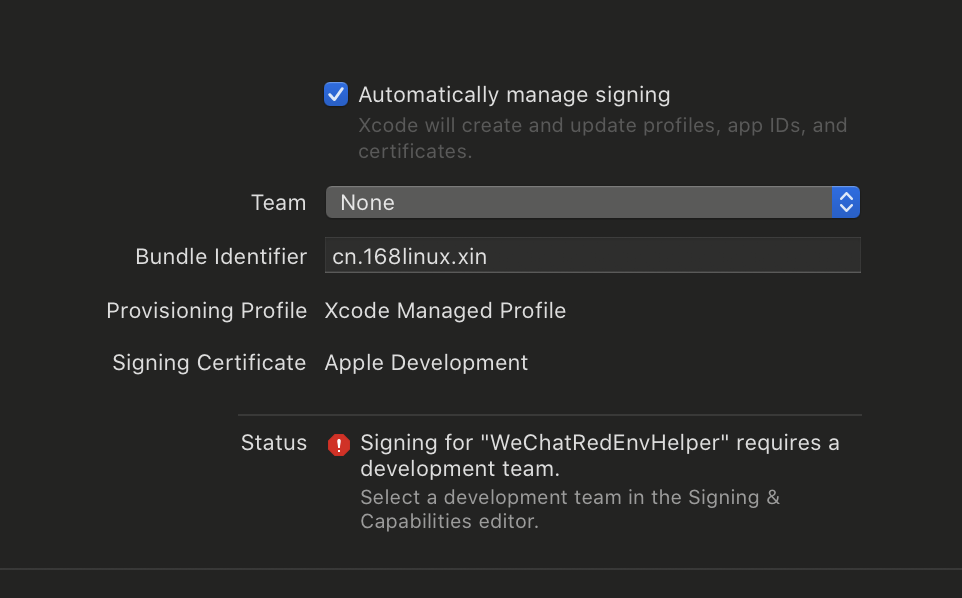
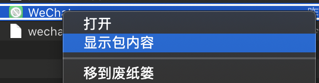

#### 微信小助手功能

* 可兼容微信7.0以上版本。
* 小游戏作弊，仅支持掷骰子和石头剪刀布。
* 自动抢群红包，支持后台抢红包。

#### Xcode方式安装

---

* 开发环境准备
  * Mac 电脑（物理机和虚拟机均可）
  * XCode开发环境
  * 开发者证书（付费账号和免费账号均可）

---

应用程序在开发环境运行时以来`theos`环境，所以我们需要预先安装`theos`。

---

* 安装theos（这里默认您已经安装好`Homebrew`，如未安装，请自行google）

```
//下拉代码到本地
sudo git clone --recursive https://github.com/theos/theos.git /opt/theos
//赋权Uid和Gid
sudo chown $(id -u):$(id -g) /opt/theos
//配置环境变量
export THEOS=/opt/theos
export PATH=/opt/theos/bin/:$PATH
//环境变量立即生效
source ~/.bash_profile
```

---

* 下拉源代码

```
git clone https://github.com/ijoery/wechatredenvhelper.git
```

* 去XX助手获取砸壳版本ipa文件。
* 将获取到的ipa文件拷贝到`./dkhelper/TargetApp`路径下。
* 双击`WeChatRedEnvHelper.xcodeproj`打开项目

---

* 修改`Bundle Identifier`为你自己的名字，一般为域名倒写，注意不要和你IOS设备上的重复，否则会出问题（具体问题在这里不解释）。
* 配置开发者证书。
  * 在Xcode中登录你的iCloud账号后，生成相应开发者证书。
  * 在Team字段选择你的证书，请参考下图：



* 将调试设备选择为真机运行，点击三角开始按钮或快捷键`Command + R`进行签名打包安装。


* 如果是免费开发者账号，真机安装完成后，需要去“设置-通用-设备描述”中对你的开发者证书进行信任，需要注意的是个人免费开发者证书的有效期只有7天，7天之后Apple会对证书进行重新验证，当然免费证书是验证不了的，所以我们就需要重新再把以上的流程跑一遍就好啦。
* 回到Home找到你刚刚安装的应用，打开即可运行。

---

#### 离线打包安装

* 在Xcode环境中完成编译
* 进入下方项目目录

```
cd WeChatRedEnvHelper/dkhelper/TargetApp
```

* 此时项目目录中会多一个`WeChat.app`的包，右键单击选择`显示包内容`



* 找到名为`Info.plist`文件，将`Bundle Identifier`修改为你和与你项目中一致的名称。
* 在同一级别目录中创建空目录`Payload`。
* 将`WeChat.app`拷贝到`Payload`目录中。
* 压缩Payload目录，重命名压缩后的包名，并将后缀改为`.ipa`结尾的名称。
* 准备一个无双重验证的iCloud账号，有双重验证的账号用不了。
* 使用`Impactor`进行安装，[Impactor下载地址](http://www.cydiaimpactor.com/)


#### 鸣谢

[DKJone](https://github.com/DKJone/DKWechatHelper.git)

